# Java API UNLEASH FEATURE FLAG
### Executando a aplicação

1. Container Unleash (executar na pasta .infraestrutura/unleash/)
```
git clone https://github.com/Unleash/unleash-docker.git
```
2. Acessar a pasta unleash-docker/
3. Criar container a partir do docker-compose.yml
```
docker composer up -d
```
4. Acessar http://localhost:4242
```
username: admin
password: unleash4all
```
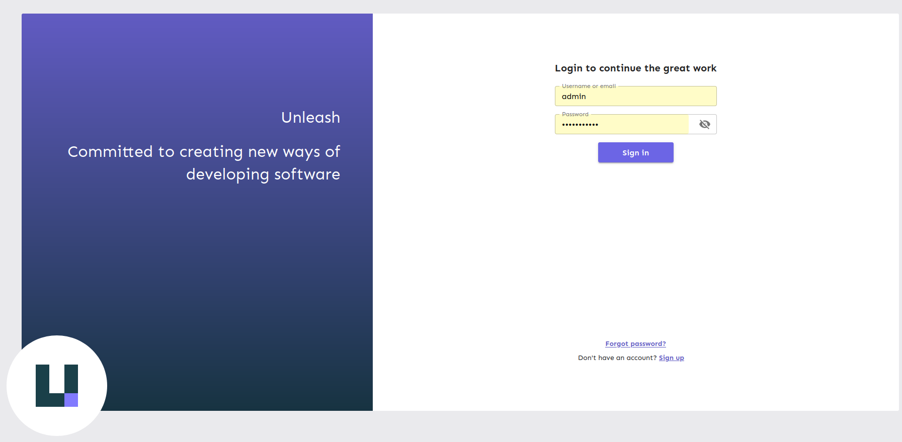
5. clickar no botão no canto superior direito "New feature toogle"
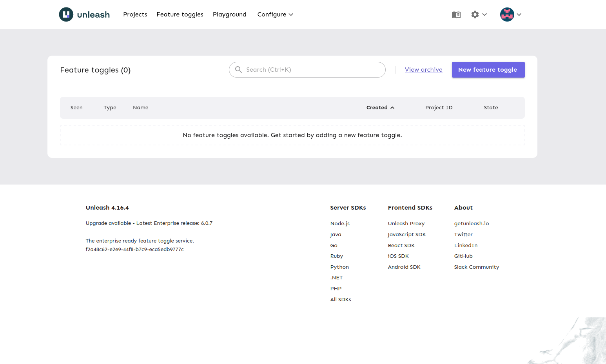
6. Cria a primeira feature flag preenchendo os campos e clicando no botão "Create feature toggle"
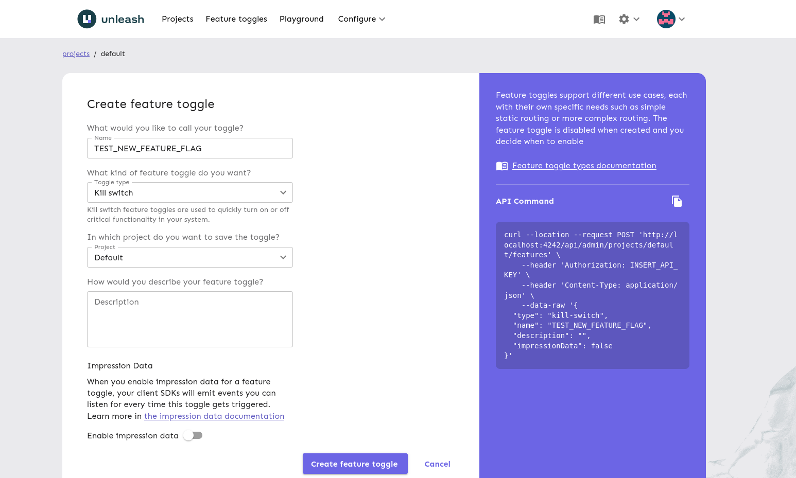
7. Adicione uma strategy clientando em "development > Add strategy > Add your first strategy > Standard"
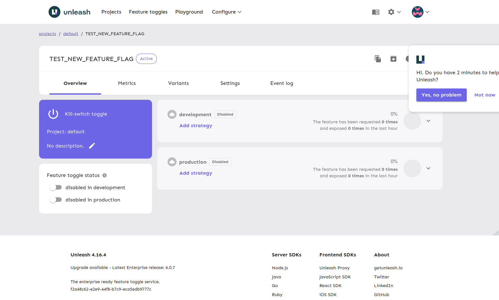
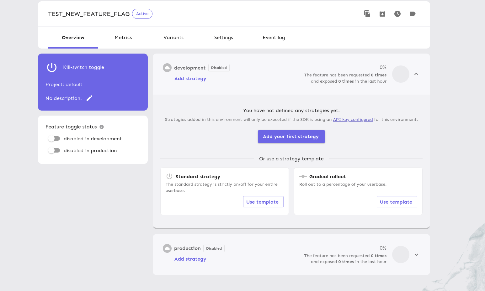
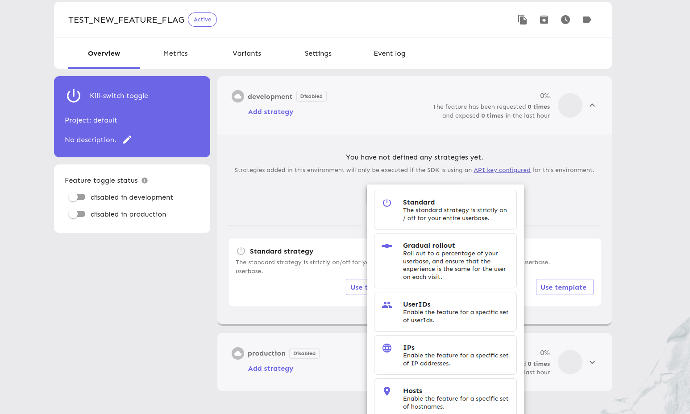
8. Clique no botão "Add constraint", preencha os campos como no exemplo, clique no botão "Save", logo depois clique em "Save strategy"
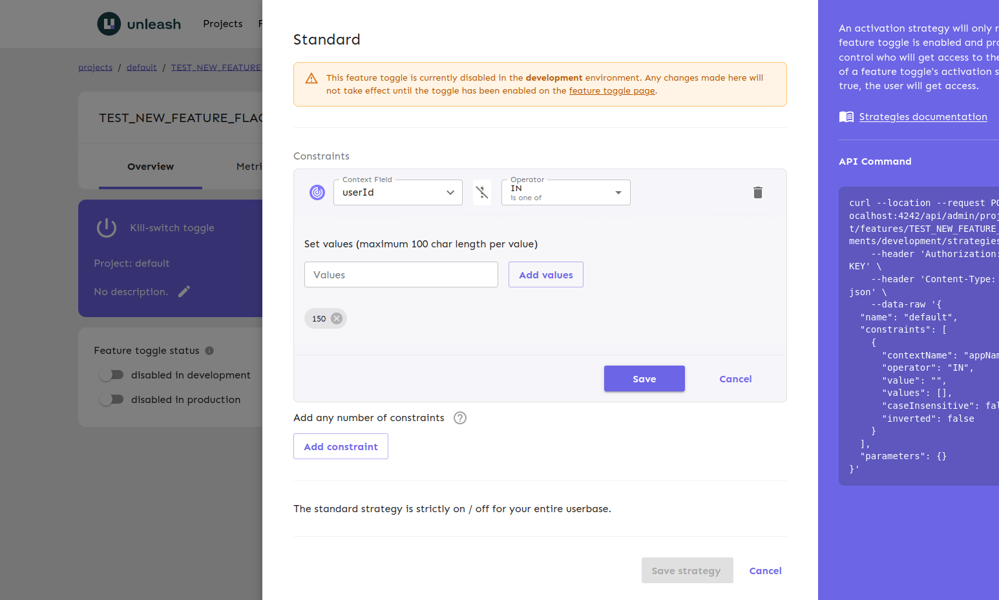
9. Criar acesso para a API no menu "Configure > API access" 
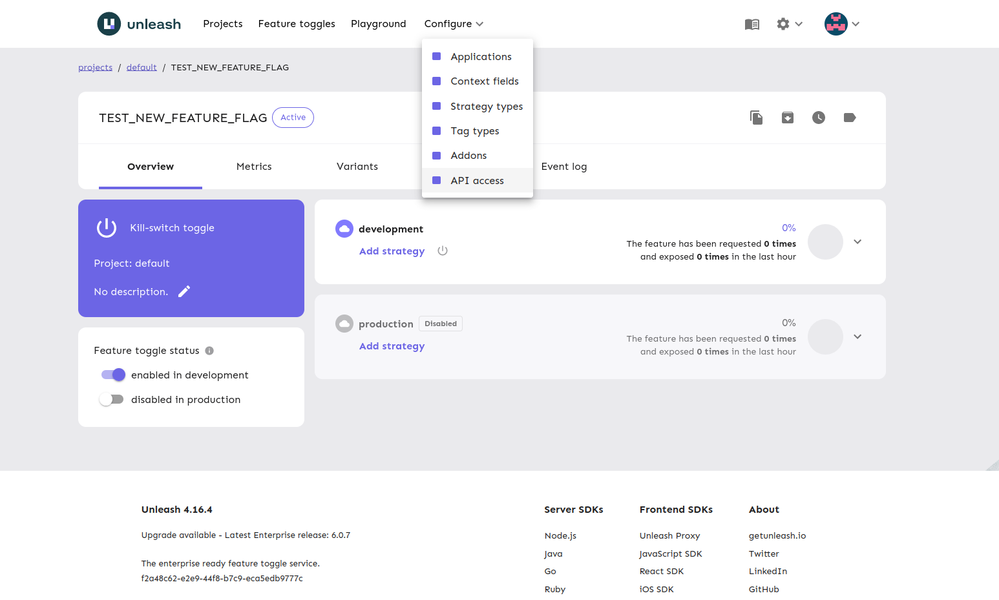
10. Clique no botão "New API token"
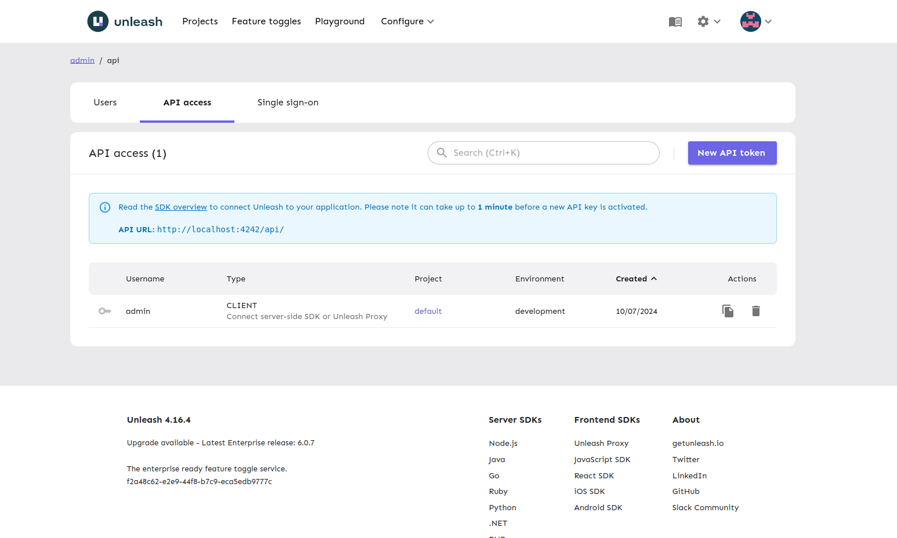
11. Preencha os campos como no exemplo e clique no botão "Create token" no fim da página
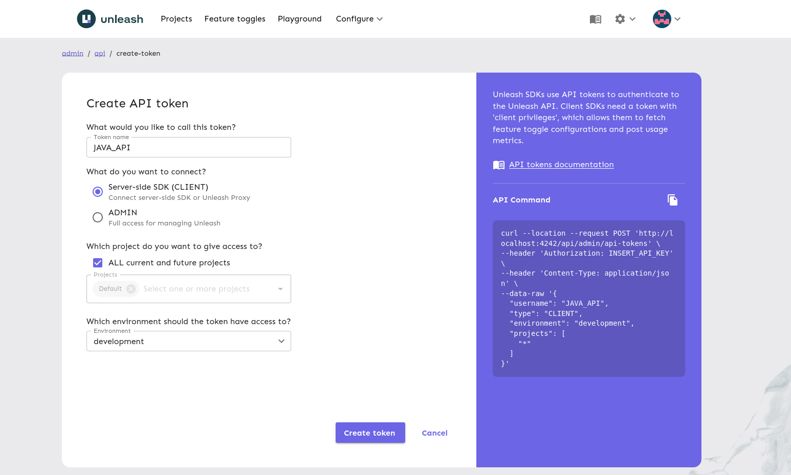
12. Copie token da API que será gerado
```
*:development.5e8ddcd992a0eaaa06f7aaf6919e939d9d82ae20e25733053a2e18c7
```
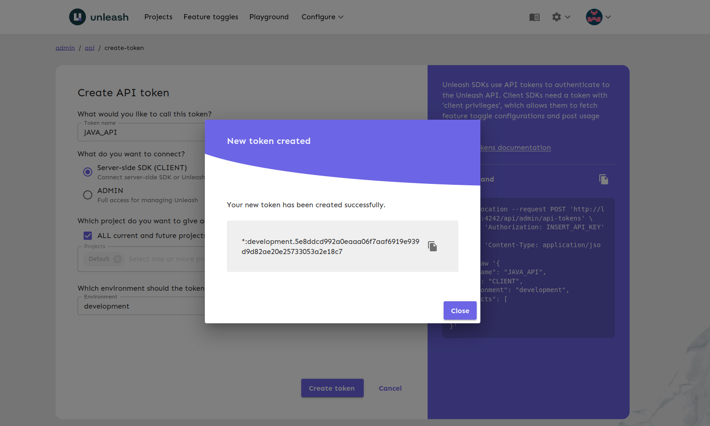
13. Copie também o código da instancia no final da página
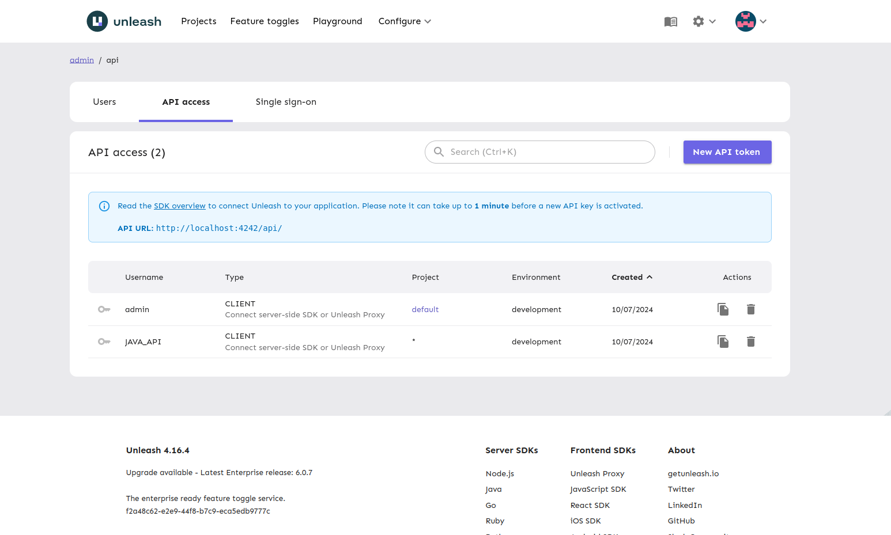
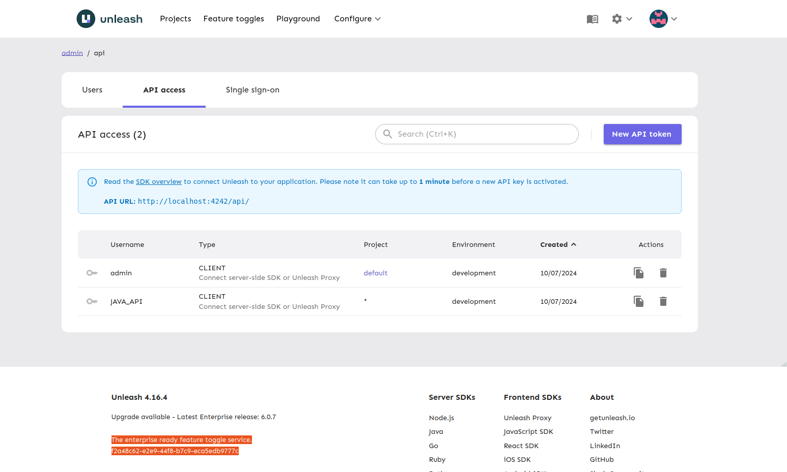
```
f2a48c62-e2e9-44f8-b7c9-eca5edb9777c
```